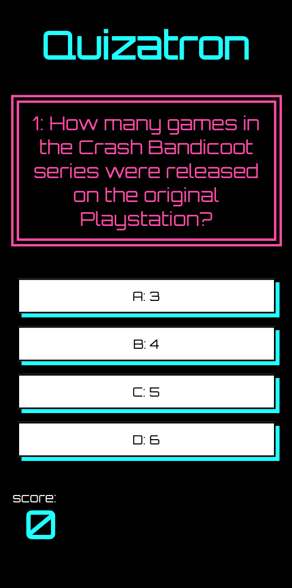

# Quizatron

### Helen Kent & Olivia McLeod

### We decided to collaborate on a simple quiz app after discovering the [Open Trivia Database](https://opentdb.com/). We used react to fetch multiple choice questions from the api and used state to check answers and save the score. 

## **[Click here for the live site hosted on Netlify](https://quizatron.netlify.app/)**

## How to use
1) Click the link above.
2) Play!

## Installation
1) Clone or download this repository.
2) cd into the project folder.
3) Run *npm install* to download dependencies.
4) Run *npm start* to run the app in your browser.